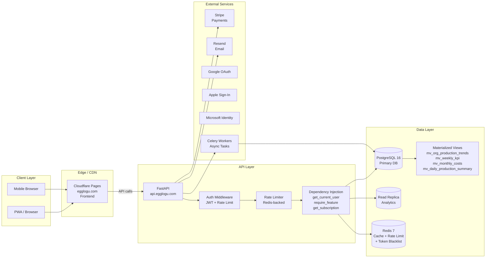
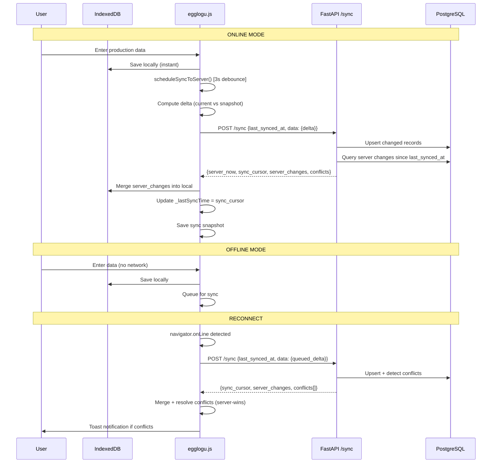

# EGGlogU — Complete System Flow Diagram

## 1. User Journey — Complete Flow

```mermaid
flowchart TB
    subgraph PUBLIC["PUBLIC ZONE (No Auth)"]
        LAND[Landing Page<br>egglogu.com] --> FAQ[FAQ / Support]
        LAND --> PRICING[Pricing Page]
        LAND --> LEAD[Submit Lead]
        LAND --> REG[Register]
        LAND --> LOGIN[Login]
        LOGIN --> GOOGLE[Google OAuth]
        LOGIN --> APPLE[Apple Sign-In]
        LOGIN --> MS[Microsoft Identity]
        LOGIN --> EMAIL_LOGIN[Email + Password]
        REG --> VERIFY[Email Verification]
        VERIFY --> EMAIL_LOGIN
        LAND --> FORGOT[Forgot Password]
        FORGOT --> RESET[Reset Password]
        RESET --> EMAIL_LOGIN
        LAND --> TRACE_PUB[Public Traceability<br>Lookup]
    end

    EMAIL_LOGIN --> DASHBOARD
    GOOGLE --> DASHBOARD
    APPLE --> DASHBOARD
    MS --> DASHBOARD

    subgraph APP["AUTHENTICATED APP"]
        DASHBOARD[Dashboard<br>KPIs + Overview]

        subgraph FARM_MGMT["Farm Management"]
            FARMS[Farms CRUD]
            FLOCKS[Flocks CRUD<br>breed, count, dates]
            FARMS --> FLOCKS
        end

        subgraph DAILY_OPS["Daily Operations"]
            PROD[Production Log<br>eggs collected/broken/sold<br>mortality]
            CHECKLIST[Daily Checklist<br>tasks + completion]
            LOGBOOK[Logbook Entries<br>observations + events]
            PERSONNEL[Personnel<br>staff tracking]
        end

        subgraph HEALTH["Health & Welfare"]
            VACCINES[Vaccines<br>schedule + admin]
            MEDS[Medications<br>treatments + dosage]
            OUTBREAKS[Outbreaks<br>tracking + resolution]
            STRESS[Stress Events<br>heat, power, predators]
            WELFARE[Animal Welfare<br>assessments + scoring]
        end

        subgraph FEED_MGMT["Feed Management"]
            FEED_BUY[Feed Purchases<br>type, qty, cost, supplier]
            FEED_USE[Feed Consumption<br>daily tracking per flock]
        end

        subgraph FINANCE["Finance"]
            INCOME[Income<br>egg sales + other]
            EXPENSES[Expenses<br>feed, labor, utilities]
            RECEIVABLES[Receivables<br>outstanding payments]
            CLIENTS[Clients<br>buyers + contacts]
            COST_CTR[Cost Centers]
        end

        subgraph ANALYTICS["Analytics & Reports"]
            ECON[Economics Dashboard<br>revenue, costs, margins]
            TRENDS[Production Trends<br>materialized views]
            DAILY_STATS[Daily Production<br>Summary]
            WEEKLY_KPI[Weekly KPI<br>per flock]
            FCR[FCR Analysis<br>feed conversion ratio]
            COSTS_MO[Monthly Costs<br>breakdown]
            REPORTS[Reports<br>downloadable]
            GRADING[Egg Grading<br>quality classification]
        end

        subgraph ENV["Environment"]
            ENV_READ[Environment Readings<br>temp, humidity, light]
            IOT[IoT Integration<br>sensor data]
            WEATHER[Weather Cache<br>external API]
        end

        subgraph BIOSEC["Biosecurity"]
            VISITORS[Visitor Log<br>entry/exit tracking]
            ZONES[Biosecurity Zones<br>risk levels]
            PEST[Pest Sightings<br>monitoring]
            PROTOCOLS[Protocols<br>SOPs + compliance]
        end

        subgraph TRACE["Traceability"]
            BATCHES[Traceability Batches<br>lot tracking]
            TRACE_PUB2[Public Lookup<br>consumer facing]
        end

        subgraph PLAN["Planning"]
            PROD_PLAN[Production Plans<br>targets + forecasts]
        end

        subgraph WORKFLOW["Workflows"]
            PRESETS[8 Preset Templates]
            RULES[Custom Rules<br>triggers + conditions]
            EVAL[Evaluate Rules<br>bulk + single test]
            EXEC[Execution History]
        end

        subgraph COMMUNITY["Community"]
            POSTS[Forum Posts<br>questions + tips]
            COMMENTS[Comments + Replies]
            REACTIONS[Reactions + Votes]
        end

        subgraph SUPPORT["Support"]
            FAQ_AUTH[FAQ Articles]
            TICKETS[Support Tickets<br>create + track]
            MESSAGES[Ticket Messages]
            AI_ASSIST[AI Assistant<br>v2.0 auto-triage]
        end

        subgraph BILLING["Billing & Plan"]
            STATUS[Plan Status<br>tier + trial info]
            CHECKOUT[Stripe Checkout]
            PORTAL[Customer Portal]
            CANCEL[Cancel Subscription]
            DELETE[Delete Account]
        end

        subgraph ADMIN["Administration"]
            AUDIT[Audit Logs<br>all actions tracked]
            API_KEYS[API Keys<br>management]
            INVENTORY[Inventory<br>supplies + stock]
            COMPLIANCE[Compliance<br>regulatory checks]
            SUPERADMIN[Super Admin<br>system management]
            CRM[CRM Dashboard<br>leads + conversions]
        end

        subgraph SYNC["Data Sync"]
            SYNC_PUSH[Delta Sync Push<br>offline → server]
            SYNC_PULL[Delta Sync Pull<br>server → offline]
            CURSOR[Sync Cursor<br>cursor-based tracking]
            CONFLICT[Conflict Resolution<br>server-wins strategy]
        end

        DASHBOARD --> FARM_MGMT
        DASHBOARD --> DAILY_OPS
        DASHBOARD --> HEALTH
        DASHBOARD --> FEED_MGMT
        DASHBOARD --> FINANCE
        DASHBOARD --> ANALYTICS
        DASHBOARD --> ENV
        DASHBOARD --> BIOSEC
        DASHBOARD --> TRACE
        DASHBOARD --> PLAN
        DASHBOARD --> WORKFLOW
        DASHBOARD --> COMMUNITY
        DASHBOARD --> SUPPORT
        DASHBOARD --> BILLING
        DASHBOARD --> ADMIN
        DASHBOARD --> SYNC
    end

    subgraph OFFLINE["OFFLINE MODE (IndexedDB)"]
        IDB[(IndexedDB<br>Local Storage)]
        PIN[Offline PIN Auth]
        LOCAL_OPS[Local Data Entry]
        QUEUE[Sync Queue]
        IDB --> LOCAL_OPS
        LOCAL_OPS --> QUEUE
        QUEUE -->|"When online"| SYNC_PUSH
    end
```

## 2. Data Flow — Backend Architecture

## 3. Sync Flow — Offline-First Architecture

## 4. Auth & Security Flow

```mermaid
flowchart TB
    subgraph AUTH_FLOW["Authentication"]
        REG[Register] -->|"email+pass+org"| HASH[bcrypt hash]
        HASH --> CREATE[Create User + Org]
        CREATE --> VERIFY_EMAIL[Send Verification Email<br>Resend API]
        VERIFY_EMAIL --> CONFIRM[User Clicks Link]
        CONFIRM --> ACTIVE[Account Active]

        LOGIN[Login] --> CHECK_LOCKED{Account<br>Locked?}
        CHECK_LOCKED -->|"Yes"| DENIED[403 Locked]
        CHECK_LOCKED -->|"No"| CHECK_PWNED[HIBP Check]
        CHECK_PWNED --> VERIFY_PASS[Verify Password]
        VERIFY_PASS -->|"Fail"| RECORD_FAIL[Record Failed Attempt<br>Redis Counter]
        RECORD_FAIL -->|">5 fails"| LOCK[Lock Account]
        VERIFY_PASS -->|"Pass"| CLEAR_FAILS[Clear Failed Logins]
        CLEAR_FAILS --> JWT[Issue JWT<br>user_id + org_id + role]
        JWT --> AUDIT_LOG[Audit: Login Success]
    end

    subgraph REQUEST_FLOW["Request Authorization"]
        REQ[API Request] --> EXTRACT[Extract JWT from Bearer]
        EXTRACT --> BLACKLIST{Token<br>Blacklisted?<br>Redis}
        BLACKLIST -->|"Yes / Redis Down"| REJECT[401 Unauthorized<br>Fail-Closed]
        BLACKLIST -->|"No"| DECODE[Decode JWT]
        DECODE --> RATE_CHECK{Rate Limit<br>OK?}
        RATE_CHECK -->|"Exceeded"| RATE_429[429 Too Many Requests]
        RATE_CHECK -->|"OK"| SUB_CHECK[Get Subscription]
        SUB_CHECK --> PLAN_CHECK{Feature<br>Allowed?}
        PLAN_CHECK -->|"No"| PLAN_403[403 Upgrade Required]
        PLAN_CHECK -->|"Yes"| EXECUTE[Execute Endpoint]
    end

    subgraph PLANS["Plan-Based Access Control"]
        HOBBY[Hobby $9/mo<br>1 farm, 2 flocks<br>Basic features]
        STARTER[Starter $19/mo<br>3 farms, 10 flocks<br>+ environment, operations]
        PRO[Pro $49/mo<br>10 farms, 50 flocks<br>+ finance, analytics, inventory]
        ENTERPRISE[Enterprise $99/mo<br>Unlimited<br>+ workflows, compliance, API keys]
    end
```

## 5. API Endpoint Map (40+ endpoints)

| Module | Method | Path | Auth | Plan |
|--------|--------|------|------|------|
| **Health** | GET | /health | No | - |
| **Auth** | POST | /auth/register | No | - |
| **Auth** | POST | /auth/login | No | - |
| **Auth** | POST | /auth/forgot-password | No | - |
| **Auth** | POST | /auth/reset-password | No | - |
| **Auth** | POST | /auth/google | No | - |
| **Auth** | GET | /auth/me | Yes | Any |
| **Auth** | PATCH | /auth/me | Yes | Any |
| **Farms** | GET/POST | /farms/ | Yes | Any |
| **Farms** | GET/PUT/DELETE | /farms/{id} | Yes | Any |
| **Flocks** | GET/POST | /flocks/ | Yes | Any |
| **Flocks** | GET/PUT/DELETE | /flocks/{id} | Yes | Any |
| **Production** | GET/POST | /production/ | Yes | Any |
| **Production** | GET/PUT/DELETE | /production/{id} | Yes | Any |
| **Vaccines** | GET/POST | /vaccines | Yes | Any |
| **Vaccines** | GET/PUT/DELETE | /vaccines/{id} | Yes | Any |
| **Medications** | GET/POST | /medications | Yes | Any |
| **Outbreaks** | GET/POST | /outbreaks | Yes | Any |
| **Stress Events** | GET/POST | /stress-events | Yes | Any |
| **Feed** | GET/POST | /feed/purchases | Yes | Any |
| **Feed** | GET/POST | /feed/consumption | Yes | Any |
| **Clients** | GET/POST | /clients/ | Yes | Any |
| **Finance** | GET/POST | /finance/incomes | Yes | Pro+ |
| **Finance** | GET/POST | /finance/expenses | Yes | Pro+ |
| **Finance** | GET/POST | /finance/receivables | Yes | Pro+ |
| **Environment** | GET/POST | /environment/readings | Yes | Starter+ |
| **Operations** | GET/POST | /operations/checklist | Yes | Starter+ |
| **Operations** | GET/POST | /operations/logbook | Yes | Starter+ |
| **Operations** | GET/POST | /operations/personnel | Yes | Starter+ |
| **Sync** | POST | /sync/ | Yes | Any |
| **Biosecurity** | GET/POST | /biosecurity/visitors | Yes | Pro+ |
| **Biosecurity** | GET/POST | /biosecurity/zones | Yes | Pro+ |
| **Biosecurity** | GET/POST | /biosecurity/protocols | Yes | Pro+ |
| **Traceability** | GET/POST | /traceability/batches | Yes | Pro+ |
| **Planning** | GET/POST | /planning/plans | Yes | Pro+ |
| **Analytics** | GET | /analytics/economics | Yes | Pro+ |
| **Analytics** | GET | /analytics/production/trends | Yes | Pro+ |
| **Analytics** | GET | /analytics/production/daily | Yes | Pro+ |
| **Analytics** | GET | /analytics/flock/{id}/weekly-kpi | Yes | Pro+ |
| **Analytics** | GET | /analytics/flock/{id}/fcr | Yes | Pro+ |
| **Analytics** | GET | /analytics/costs/monthly | Yes | Pro+ |
| **Workflows** | GET | /workflows/presets | Yes | Enterprise |
| **Workflows** | GET/POST | /workflows/rules | Yes | Enterprise |
| **Workflows** | POST | /workflows/evaluate | Yes | Enterprise |
| **Workflows** | GET | /workflows/executions | Yes | Enterprise |
| **Community** | GET/POST | /community/posts | Yes | Any |
| **Support** | GET | /support/faq | No | - |
| **Support** | GET/POST | /support/tickets | Yes | Any |
| **Billing** | GET | /billing/pricing | No | - |
| **Billing** | GET | /billing/status | Yes | Any |
| **Billing** | POST | /billing/create-checkout | Yes | Any |
| **Audit** | GET | /audit/logs | Yes | Pro+ |
| **Inventory** | GET/POST | /inventory/ | Yes | Pro+ |
| **Compliance** | GET | /compliance/ | Yes | Enterprise |
| **Grading** | GET/POST | /grading/ | Yes | Pro+ |
| **Animal Welfare** | GET/POST | /animal-welfare/assessments | Yes | Pro+ |
| **API Keys** | GET/POST | /api-keys/ | Yes | Enterprise |
| **Reports** | GET | /reports/ | Yes | Pro+ |
| **Leads** | POST | /leads/ | No | - |
| **Trace Public** | GET | /trace/{batch_id} | No | - |

## 6. Stress Test Scenarios

| Scenario | VUs | Duration | Purpose | SLA |
|----------|-----|----------|---------|-----|
| Smoke | 5 | 15s | Sanity check | p95 < 200ms |
| Load | 50 | 30s | Normal production | p95 < 500ms, err < 1% |
| Stress | 200 | 60s | 2x peak | p95 < 1s, err < 5% |
| Spike | 0→500 | 30s | Burst traffic | Recovery < 30s |
| Soak | 30 | 5 min | Memory leaks | No degradation |
| Full | 5→500 | 3 min | All stages | Composite pass |

## 7. Client Simulation Profiles

| Profile | % Traffic | Behavior | Requests/Session |
|---------|-----------|----------|------------------|
| Public Visitor | 30% | FAQ, pricing, lead submit | 3-5 |
| Daily Operator | 40% | Production logging, feed, health | 50-100 |
| Farm Manager | 20% | Analytics, finance, billing, reports | 20-40 |
| Power User | 10% | Sync, workflows, API, bulk ops | 30-60 |
